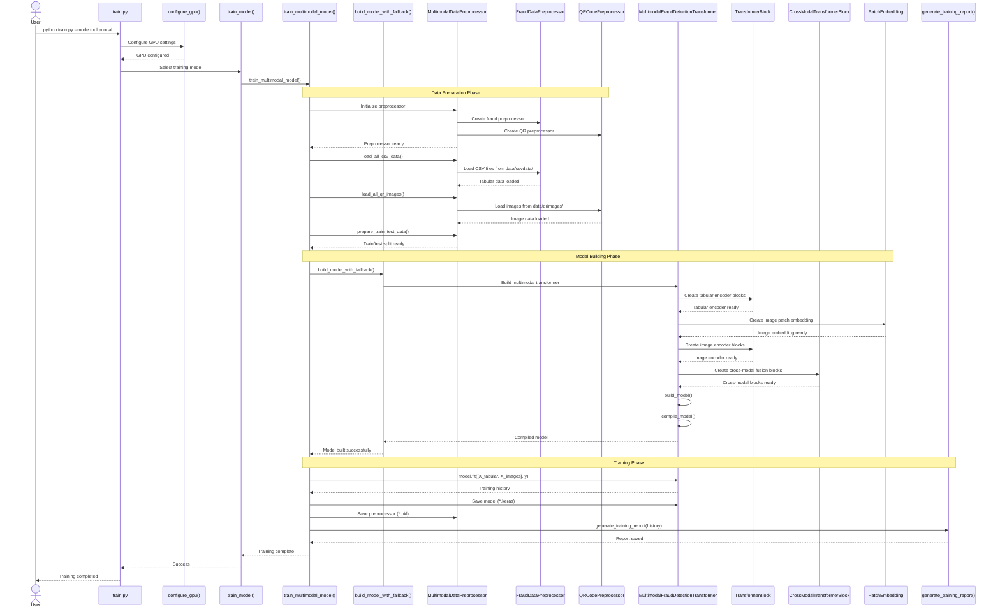
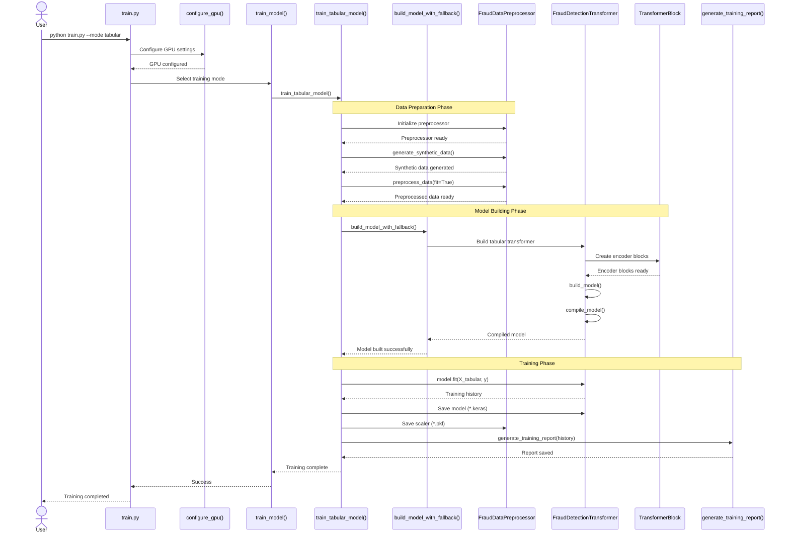
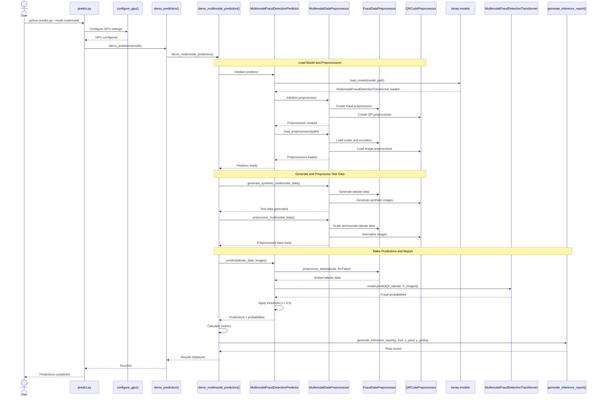
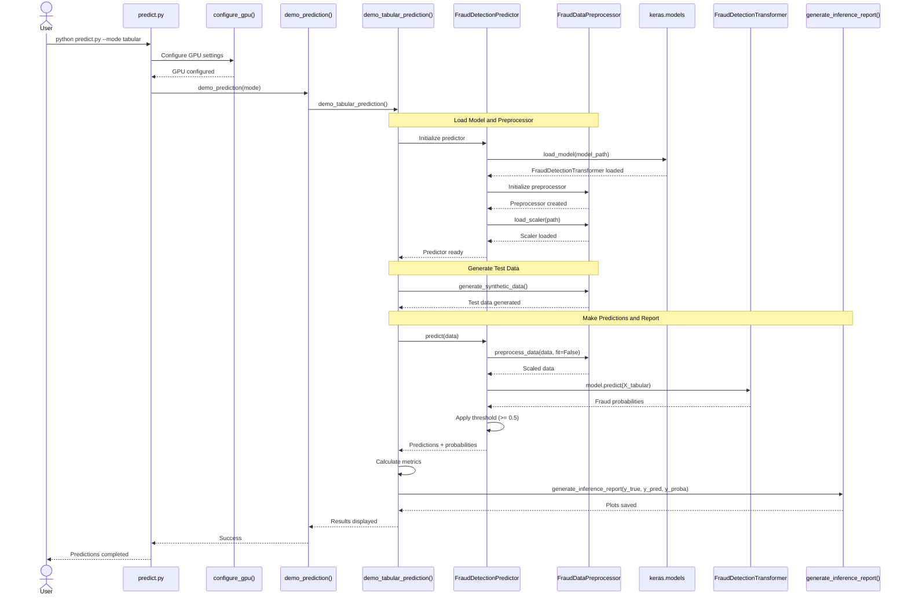
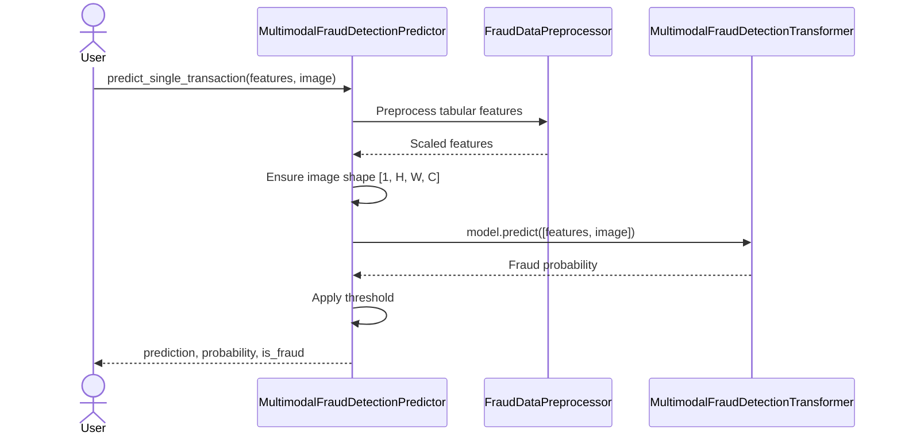
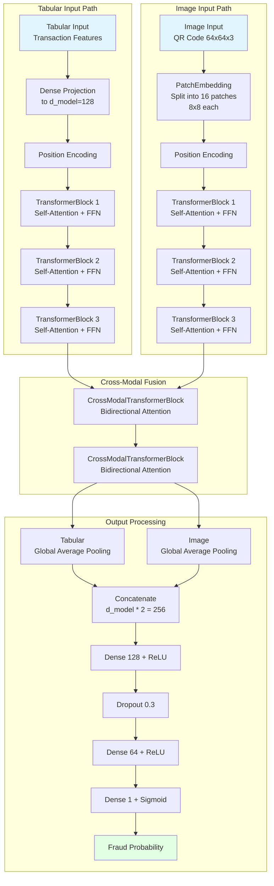
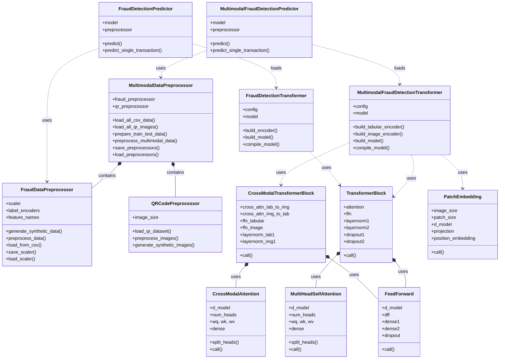

# Multimodal Fraud Detection Transformer - Mermaid Architecture Diagrams

> **✅ Validation Status**: All diagrams validated and verified for correct Mermaid syntax (Last validated: 2026-02-07)  
> **📊 Diagram Count**: 11 Mermaid diagrams  
> **🎨 Compatibility**: GitHub, GitLab, VS Code, and all Mermaid-compatible viewers

This document contains comprehensive Mermaid diagrams for the Multimodal Fraud Detection Transformer system, including architecture diagrams, sequence flows, and detailed concept explanations.

## Table of Contents

1. [System Architecture Overview](#1-system-architecture-overview)
2. [Training Flow Sequence](#2-training-flow-sequence)
3. [Prediction Flow Sequence](#3-prediction-flow-sequence)
4. [Data Flow Architecture](#4-data-flow-architecture)
5. [Transformer Model Architecture](#5-transformer-model-architecture)
6. [Class Relationships](#6-class-relationships)
7. [Concepts and Flow Explanations](#7-concepts-and-flow-explanations)

---

## 1. System Architecture Overview

This diagram shows the complete component architecture of the Multimodal Fraud Detection Transformer system.

> **Note**: The diagram shows simplified component names (e.g., `train.py`) for clarity. The actual files are located in the `src/` directory (e.g., `src/train.py`). Commands shown in this document use the correct paths (e.g., `python src/train.py`).

```mermaid
graph TB
    subgraph "Entry Points"
        TRAIN[train.py]
        PREDICT[predict.py]
    end

    subgraph "Configuration"
        CONFIG[config.py]
    end

    subgraph "Training Module"
        CONFIGURE_GPU[configure_gpu]
        FORCE_CPU[force_cpu_execution]
        BUILD_FALLBACK[build_model_with_fallback]
        TRAIN_MODEL[train_model]
        TRAIN_MULTI[train_multimodal_model]
        TRAIN_TAB[train_tabular_model]
    end

    subgraph "Prediction Module"
        MULTI_PRED[MultimodalFraudDetectionPredictor]
        TAB_PRED[FraudDetectionPredictor]
        DEMO_PRED[demo_prediction]
        DEMO_MULTI[demo_multimodal_prediction]
        DEMO_TAB[demo_tabular_prediction]
    end

    subgraph "Data Preprocessing"
        FRAUD_PREP[FraudDataPreprocessor]
        QR_PREP[QRCodePreprocessor]
        MULTI_DATA_PREP[MultimodalDataPreprocessor]
    end

    subgraph "Core Transformer Layers"
        FEEDFORWARD[FeedForward]
        RESIDUAL[ResidualConnection]
    end

    subgraph "Attention Mechanisms"
        MHSA[MultiHeadSelfAttention]
        MASKED_ATTN[MaskedMultiHeadAttention]
        CROSS_ATTN[CrossModalAttention]
    end

    subgraph "Transformer Blocks"
        TRANS_BLOCK[TransformerBlock]
        DECODER_BLOCK[TransformerDecoderBlock]
        CROSS_BLOCK[CrossModalTransformerBlock]
    end

    subgraph "Embeddings"
        PATCH_EMB[PatchEmbedding]
    end

    subgraph "Main Models"
        MULTI_MODEL[MultimodalFraudDetectionTransformer]
        TAB_MODEL[FraudDetectionTransformer]
    end

    subgraph "Utilities"
        TRAIN_REPORT[generate_training_report]
        INFER_REPORT[generate_inference_report]
    end

    %% Entry Point Connections
    TRAIN --> CONFIGURE_GPU
    TRAIN --> TRAIN_MODEL
    PREDICT --> DEMO_PRED
    TRAIN -.-> CONFIG
    PREDICT -.-> CONFIG

    %% Training Flow
    TRAIN_MODEL --> TRAIN_MULTI
    TRAIN_MODEL --> TRAIN_TAB
    TRAIN_MULTI --> CONFIGURE_GPU
    TRAIN_TAB --> CONFIGURE_GPU
    TRAIN_MULTI --> BUILD_FALLBACK
    TRAIN_TAB --> BUILD_FALLBACK
    BUILD_FALLBACK --> FORCE_CPU

    %% Training with Preprocessors
    TRAIN_MULTI --> MULTI_DATA_PREP
    TRAIN_TAB --> FRAUD_PREP
    TRAIN_MULTI --> MULTI_MODEL
    TRAIN_TAB --> TAB_MODEL
    TRAIN_MULTI --> TRAIN_REPORT
    TRAIN_TAB --> TRAIN_REPORT

    %% Prediction Flow
    DEMO_PRED --> DEMO_MULTI
    DEMO_PRED --> DEMO_TAB
    DEMO_MULTI --> MULTI_PRED
    DEMO_TAB --> TAB_PRED
    DEMO_MULTI --> INFER_REPORT
    DEMO_TAB --> INFER_REPORT

    %% Predictor Dependencies
    MULTI_PRED --> MULTI_DATA_PREP
    TAB_PRED --> FRAUD_PREP

    %% Preprocessor Composition
    MULTI_DATA_PREP --> FRAUD_PREP
    MULTI_DATA_PREP --> QR_PREP

    %% Model Uses Transformer Blocks
    MULTI_MODEL --> TRANS_BLOCK
    MULTI_MODEL --> CROSS_BLOCK
    MULTI_MODEL --> PATCH_EMB
    TAB_MODEL --> TRANS_BLOCK

    %% Transformer Block Composition
    TRANS_BLOCK --> MHSA
    TRANS_BLOCK --> FEEDFORWARD
    DECODER_BLOCK --> MASKED_ATTN
    DECODER_BLOCK --> CROSS_ATTN
    DECODER_BLOCK --> FEEDFORWARD
    CROSS_BLOCK --> CROSS_ATTN
    CROSS_BLOCK --> FEEDFORWARD

    style TRAIN fill:#e1f5ff
    style PREDICT fill:#e1f5ff
    style MULTI_MODEL fill:#ffe1e1
    style TAB_MODEL fill:#ffe1e1
    style MULTI_PRED fill:#e1ffe1
    style TAB_PRED fill:#e1ffe1
```



---

## 2. Training Flow Sequence

This sequence diagram illustrates the complete training workflow for both multimodal and tabular modes.

### 2.1 Multimodal Training Flow



### 2.2 Tabular Training Flow



---

## 3. Prediction Flow Sequence

This sequence diagram illustrates the complete prediction/inference workflow.

### 3.1 Multimodal Prediction Flow



### 3.2 Tabular Prediction Flow



### 3.3 Single Transaction Prediction



---

## 4. Data Flow Architecture

This diagram shows how data flows through the entire system from raw input to final predictions.

```mermaid
graph TD
    subgraph "Data Sources"
        CSV[CSV Transaction Data<br/>data/csvdata/]
        IMAGES[QR Code Images<br/>data/qrimages/]
    end

    subgraph "Data Loading"
        LOAD_CSV[Load CSV Files]
        LOAD_IMG[Load Image Files]
    end

    subgraph "Preprocessing"
        SCALE[Scaling & Normalization]
        ENCODE[Label Encoding]
        RESIZE[Image Resizing]
        NORMALIZE[Image Normalization]
    end

    subgraph "Feature Engineering"
        TAB_FEATURES[Tabular Features<br/>Amount, Type, Balance, etc.]
        IMG_FEATURES[Image Tensors<br/>64x64x3]
    end

    subgraph "Model Input"
        TAB_INPUT[Tabular Input Tensor<br/>shape: [batch, features]]
        IMG_INPUT[Image Input Tensor<br/>shape: [batch, 64, 64, 3]]
    end

    subgraph "Encoder Stage"
        TAB_ENCODER[Tabular Encoder<br/>Dense + Transformers]
        IMG_ENCODER[Image Encoder<br/>PatchEmbed + Transformers]
    end

    subgraph "Fusion Stage"
        CROSS_MODAL[Cross-Modal Fusion<br/>CrossModalTransformerBlock]
        TAB_POOL[Tabular Global Pooling]
        IMG_POOL[Image Global Pooling]
    end

    subgraph "Classification Stage"
        CONCAT[Concatenate Features]
        DENSE1[Dense Layer 128]
        DROPOUT[Dropout 0.3]
        DENSE2[Dense Layer 64]
        OUTPUT[Sigmoid Output<br/>Fraud Probability]
    end

    subgraph "Post-Processing"
        THRESHOLD[Apply Threshold 0.5]
        METRICS[Calculate Metrics]
    end

    subgraph "Output"
        PREDICTION[Fraud Prediction<br/>0: Legitimate<br/>1: Fraudulent]
        PROBABILITY[Fraud Probability<br/>0.0 to 1.0]
    end

    CSV --> LOAD_CSV
    IMAGES --> LOAD_IMG

    LOAD_CSV --> SCALE
    LOAD_CSV --> ENCODE
    LOAD_IMG --> RESIZE
    LOAD_IMG --> NORMALIZE

    SCALE --> TAB_FEATURES
    ENCODE --> TAB_FEATURES
    RESIZE --> IMG_FEATURES
    NORMALIZE --> IMG_FEATURES

    TAB_FEATURES --> TAB_INPUT
    IMG_FEATURES --> IMG_INPUT

    TAB_INPUT --> TAB_ENCODER
    IMG_INPUT --> IMG_ENCODER

    TAB_ENCODER --> CROSS_MODAL
    IMG_ENCODER --> CROSS_MODAL

    CROSS_MODAL --> TAB_POOL
    CROSS_MODAL --> IMG_POOL

    TAB_POOL --> CONCAT
    IMG_POOL --> CONCAT

    CONCAT --> DENSE1
    DENSE1 --> DROPOUT
    DROPOUT --> DENSE2
    DENSE2 --> OUTPUT

    OUTPUT --> THRESHOLD
    THRESHOLD --> METRICS

    METRICS --> PREDICTION
    METRICS --> PROBABILITY

    style CSV fill:#e1f5ff
    style IMAGES fill:#e1f5ff
    style OUTPUT fill:#ffe1e1
    style PREDICTION fill:#e1ffe1
    style PROBABILITY fill:#e1ffe1
```

---

## 5. Transformer Model Architecture

This diagram illustrates the internal architecture of the multimodal transformer model.

### 5.1 Multimodal Transformer Architecture



### 5.2 Transformer Block Internal Architecture

```mermaid
graph TB
    INPUT[Input Tensor<br/>shape: [batch, seq_len, d_model]]
    
    subgraph "Multi-Head Self-Attention"
        SPLIT[Split into num_heads]
        Q[Query Projection]
        K[Key Projection]
        V[Value Projection]
        ATTN[Scaled Dot-Product<br/>Attention]
        CONCAT_H[Concatenate Heads]
        DENSE_ATTN[Dense Projection]
    end
    
    ADD1[Add & Norm<br/>Residual Connection]
    
    subgraph "Feed-Forward Network"
        DENSE_FFN1[Dense d_ff=512<br/>+ ReLU]
        DENSE_FFN2[Dense d_model=128]
    end
    
    ADD2[Add & Norm<br/>Residual Connection]
    
    OUTPUT[Output Tensor<br/>shape: [batch, seq_len, d_model]]

    INPUT --> SPLIT
    SPLIT --> Q
    SPLIT --> K
    SPLIT --> V
    Q --> ATTN
    K --> ATTN
    V --> ATTN
    ATTN --> CONCAT_H
    CONCAT_H --> DENSE_ATTN
    
    INPUT -.Residual.-> ADD1
    DENSE_ATTN --> ADD1
    
    ADD1 --> DENSE_FFN1
    DENSE_FFN1 --> DENSE_FFN2
    
    ADD1 -.Residual.-> ADD2
    DENSE_FFN2 --> ADD2
    
    ADD2 --> OUTPUT

    style INPUT fill:#e1f5ff
    style OUTPUT fill:#e1ffe1
```

### 5.3 Cross-Modal Transformer Block Architecture

```mermaid
graph TB
    TAB_IN[Tabular Features<br/>shape: [batch, seq, d_model]]
    IMG_IN[Image Features<br/>shape: [batch, seq, d_model]]

    subgraph "Tabular to Image Attention"
        TAB_TO_IMG[CrossModalAttention<br/>Q: Tabular, K,V: Image]
        TAB_ADD1[Add & Norm]
    end

    subgraph "Image to Tabular Attention"
        IMG_TO_TAB[CrossModalAttention<br/>Q: Image, K,V: Tabular]
        IMG_ADD1[Add & Norm]
    end

    subgraph "Tabular Feed-Forward"
        TAB_FFN[FeedForward Network]
        TAB_ADD2[Add & Norm]
    end

    subgraph "Image Feed-Forward"
        IMG_FFN[FeedForward Network]
        IMG_ADD2[Add & Norm]
    end

    TAB_OUT[Enriched Tabular Features]
    IMG_OUT[Enriched Image Features]

    TAB_IN --> TAB_TO_IMG
    IMG_IN --> TAB_TO_IMG
    TAB_IN -.Residual.-> TAB_ADD1
    TAB_TO_IMG --> TAB_ADD1

    IMG_IN --> IMG_TO_TAB
    TAB_IN --> IMG_TO_TAB
    IMG_IN -.Residual.-> IMG_ADD1
    IMG_TO_TAB --> IMG_ADD1

    TAB_ADD1 --> TAB_FFN
    TAB_ADD1 -.Residual.-> TAB_ADD2
    TAB_FFN --> TAB_ADD2

    IMG_ADD1 --> IMG_FFN
    IMG_ADD1 -.Residual.-> IMG_ADD2
    IMG_FFN --> IMG_ADD2

    TAB_ADD2 --> TAB_OUT
    IMG_ADD2 --> IMG_OUT

    style TAB_IN fill:#e1f5ff
    style IMG_IN fill:#e1f5ff
    style TAB_OUT fill:#e1ffe1
    style IMG_OUT fill:#e1ffe1
```

---

## 6. Class Relationships

This diagram shows the relationships between major classes in the system.



---

## 7. Concepts and Flow Explanations

### 7.1 System Overview

The Multimodal Fraud Detection Transformer is an advanced machine learning system that combines two different types of data (modalities) to detect fraudulent transactions:

1. **Tabular Data**: Traditional transaction features like amount, type, balance changes, etc.
2. **Image Data**: QR code images that might be associated with the transaction

By fusing information from both modalities using transformer-based neural networks with cross-attention mechanisms, the system can detect fraud patterns that would be missed by looking at either data type alone.

### 7.2 Key Architectural Concepts

#### Transformer Architecture

Transformers are neural network architectures that use **attention mechanisms** to process sequential or structured data. Key components include:

- **Self-Attention**: Allows each element to "attend to" (focus on) other elements in the sequence
- **Multi-Head Attention**: Runs multiple attention mechanisms in parallel to capture different types of relationships
- **Feed-Forward Networks**: Position-wise fully connected layers that process each position independently
- **Residual Connections**: Skip connections that help with training deep networks
- **Layer Normalization**: Normalizes activations to stabilize training

#### Vision Transformer (ViT) for Images

For processing images, the system uses a Vision Transformer approach:

1. **Patch Extraction**: Divide the 64×64 image into 16 non-overlapping 8×8 patches
2. **Flatten and Project**: Flatten each patch and project to model dimension (128)
3. **Position Encoding**: Add learnable position embeddings to preserve spatial information
4. **Transformer Processing**: Process patches through transformer encoder blocks

This allows the model to learn relationships between different parts of the QR code image.

#### Cross-Modal Fusion

The most innovative aspect of this architecture is the **CrossModalTransformerBlock**, which implements bidirectional cross-attention:

```
Tabular Features ←→ Image Features
```

- **Tabular → Image Attention**: Tabular features query the image features to find relevant visual patterns
- **Image → Tabular Attention**: Image features query the tabular features to understand transaction context

This bidirectional exchange allows both modalities to inform and enrich each other, creating a unified representation that captures multimodal fraud patterns.

### 7.3 Training Flow

#### Phase 1: Data Preparation
1. Load CSV files containing transaction data
2. Load QR code images from the dataset
3. Apply preprocessing:
   - **Tabular**: StandardScaler for normalization, LabelEncoder for categorical features
   - **Images**: Resize to 64×64, normalize pixel values to [0, 1]
4. Split into training and testing sets (80/20)

#### Phase 2: Model Building
1. Build two separate encoder paths:
   - **Tabular Encoder**: Dense projection + 3 TransformerBlocks
   - **Image Encoder**: PatchEmbedding + 3 TransformerBlocks
2. Add cross-modal fusion layers (2 CrossModalTransformerBlocks)
3. Add global pooling for both paths
4. Concatenate pooled features
5. Add classification head (Dense layers → Sigmoid)

#### Phase 3: Training
1. Compile model with:
   - **Optimizer**: Adam with learning rate 0.001
   - **Loss**: Binary Crossentropy (fraud/not fraud)
   - **Metrics**: Accuracy, Precision, Recall, AUC
2. Train with early stopping and learning rate reduction
3. Save trained model and preprocessors
4. Generate training report with loss/accuracy plots

#### GPU Fallback Mechanism

The training module includes robust GPU handling:

```python
try:
    model = build_model_with_gpu()
except GPUError:
    force_cpu_execution()
    model = build_model_with_cpu()
```

This ensures training can proceed even if GPU initialization fails.

### 7.4 Prediction Flow

#### Phase 1: Model Loading
1. Load saved Keras model (*.keras file)
2. Load preprocessors (*.pkl file)
3. Initialize predictor class

#### Phase 2: Data Preprocessing
1. Scale tabular features using loaded scaler (fit=False, only transform)
2. Normalize images to [0, 1] range
3. Ensure correct tensor shapes

#### Phase 3: Inference
1. Feed preprocessed data to model
2. Model outputs fraud probability (0.0 to 1.0)
3. Apply threshold (default 0.5):
   - Probability ≥ 0.5 → Fraudulent (class 1)
   - Probability < 0.5 → Legitimate (class 0)

#### Phase 4: Reporting
1. Calculate metrics:
   - **Accuracy**: Overall correctness
   - **Precision**: Of predicted frauds, how many are actually frauds
   - **Recall**: Of actual frauds, how many are detected
   - **F1-Score**: Harmonic mean of precision and recall
2. Generate visualization plots:
   - Confusion matrix
   - ROC curve
   - Precision-Recall curve
   - Probability distribution

### 7.5 Model Modes

#### Multimodal Mode (Recommended)
- Uses both tabular and image data
- Better fraud detection accuracy
- Can capture visual fraud patterns in QR codes
- Command: `python src/train.py --mode multimodal`

#### Tabular-Only Mode (Backward Compatible)
- Uses only transaction features
- Faster training and inference
- Useful when image data is unavailable
- Command: `python src/train.py --mode tabular`

### 7.6 Data Flow Summary

```
1. Raw Data → Preprocessing → Normalized Tensors
2. Tabular Tensors → Dense + Transformers → Tabular Features
3. Image Tensors → PatchEmbed + Transformers → Image Features
4. Both Features → Cross-Modal Attention → Fused Features
5. Fused Features → Global Pooling → Dense Layers → Probability
6. Probability → Threshold → Classification (Fraud/Legitimate)
```

### 7.7 Attention Mechanism Explained

The attention mechanism computes a weighted average of values based on the similarity between queries and keys:

```
Attention(Q, K, V) = softmax(Q·K^T / √d_k) · V
```

Where:
- **Q (Query)**: "What am I looking for?"
- **K (Key)**: "What information do I have?"
- **V (Value)**: "What is the actual information?"
- **d_k**: Dimension of key vectors (for scaling)

In **cross-modal attention**:
- Tabular features create queries
- Image features provide keys and values
- Result: Tabular features enriched with relevant image information

### 7.8 Configuration Management

The system uses a centralized configuration file (`config/config.py`) that controls:
- **Data paths**: CSV and image directories
- **Model hyperparameters**: d_model, num_heads, num_layers, dropout
- **Training parameters**: batch_size, epochs, learning_rate
- **Hardware settings**: GPU configuration

To switch between environments (AWS EC2 vs GitHub Codespaces), only one line needs to be changed:
```python
DATA_BASE_PATH = '/home/ec2-user'  # AWS EC2
# or
DATA_BASE_PATH = '/workspaces/test/data'  # GitHub Codespaces
```

### 7.9 Performance Considerations

#### GPU Acceleration
- Tested on NVIDIA A10G GPU
- Typical training time: 5-10 minutes for 50 epochs
- Memory requirements: ~4GB GPU memory

#### CPU Fallback
- Automatic CPU fallback if GPU fails
- Slower but ensures training can complete
- Typical training time: 20-40 minutes for 50 epochs

#### Model Size
- Multimodal model: ~2-3 MB
- Tabular-only model: ~1-2 MB
- Preprocessors: ~100-500 KB

### 7.10 Production Deployment

The predictor classes (`MultimodalFraudDetectionPredictor`, `FraudDetectionPredictor`) provide production-ready interfaces:

```python
# Initialize once
predictor = MultimodalFraudDetectionPredictor(
    model_path='models/multimodal_model.keras',
    preprocessor_path='models/multimodal_preprocessor.pkl'
)

# Use for multiple predictions
for transaction in transactions:
    result = predictor.predict_single_transaction(
        tabular_features=transaction['features'],
        image=transaction['qr_code']
    )
    if result['is_fraud']:
        flag_for_review(transaction, result['probability'])
```

### 7.11 Key Benefits of Multimodal Approach

1. **Complementary Information**: Visual and numerical features capture different aspects of fraud
2. **Robustness**: If one modality is noisy or incomplete, the other can compensate
3. **Novel Patterns**: Can detect fraud patterns invisible to single-modality systems
4. **Attention Visualization**: Cross-attention weights show which visual regions are important for each transaction
5. **Flexibility**: Can fall back to tabular-only mode when images are unavailable

---

## Summary

This comprehensive documentation provides all the architecture diagrams in Mermaid format, including:

✅ **System Architecture Overview** - Complete component structure
✅ **Training Flow Sequences** - Both multimodal and tabular training workflows
✅ **Prediction Flow Sequences** - Both multimodal and tabular inference workflows
✅ **Data Flow Architecture** - End-to-end data processing pipeline
✅ **Transformer Model Architecture** - Internal model structure and components
✅ **Class Relationships** - Object-oriented design structure
✅ **Detailed Concept Explanations** - Theory and implementation details

All diagrams are rendered using Mermaid syntax and can be viewed in:
- GitHub markdown (native support)
- GitLab markdown (native support)
- VS Code with Mermaid extension
- Any Mermaid-compatible markdown viewer

For the original PlantUML diagrams, refer to:
- `architecture.puml`
- `training_sequence.puml`
- `prediction_sequence.puml`
- `ARCHITECTURE.md`
- `DIAGRAMS_README.md`
